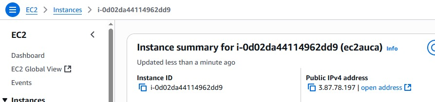
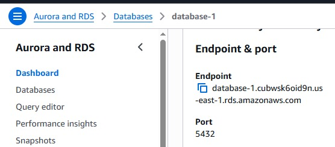
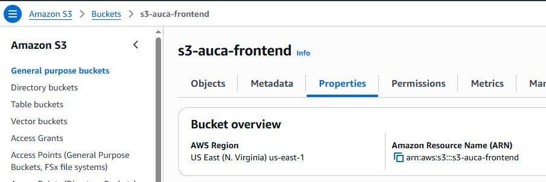

# Sebastián Aucapiña Workshop

**Link to demostration video:**
[Demostration Video](https://youtu.be/-djoqRgWCs4)

--- 

# Details of the workshop

For the workshop the next AWS services were used:
1. Amazon Elactic Compute Cloud (EC2)
2. Amazon Relational Database Service (RDS)
3. Amazon Simple Storage Service (S3)

In this context, S3 hosts a static web page made with [React](https://es.react.dev/).
In addition, EC2 hosts a backend made with Python; using [FastAPI](https://fastapi.tiangolo.com/) and [SQLModel](https://sqlmodel.tiangolo.com/).
Finally, S3 works with a [PostgreSQL](https://www.postgresql.org/) relational database.

## Description of Elements presented in the video
- **Amazon EC2:**
  - ***IP Assiged during the video:*** 3.87.78.197
  - ***Instance ID:*** i-0d02da44114962dd9
- **Amazon RDS:**
  - ***Endpoint:*** database-1.cubwsk6oid9n.us-east-1.rds.amazonaws.com
- **Amazon S3:**
  - ***S3 ARN:*** arn:aws:s3:::s3-auca-frontend

## EC2

## RDS

## S3

